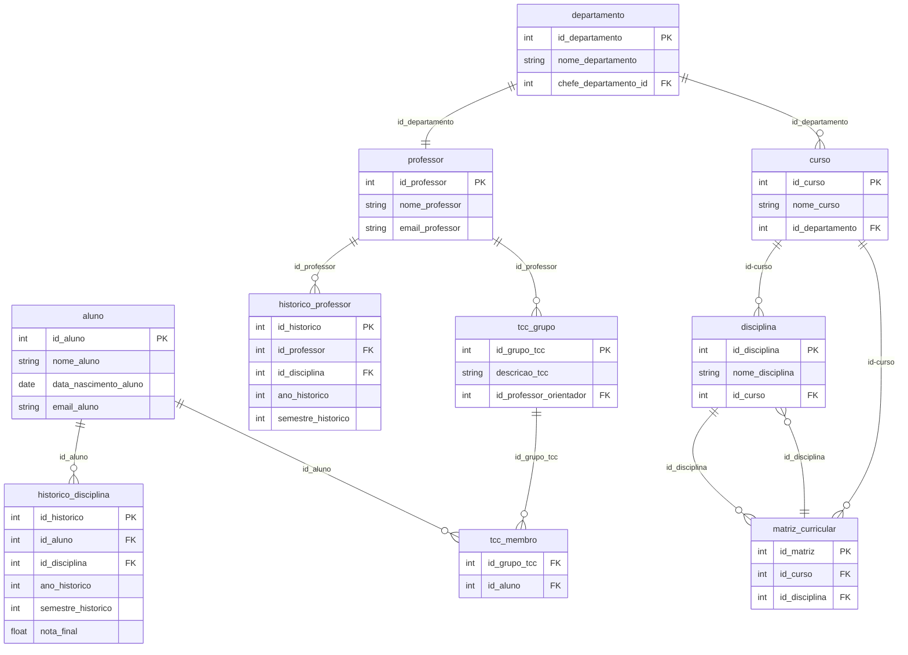

Criação do Banco de Dados: No PostgreSQL, crie um banco com o nome desejado.

Execução do Script SQL: Execute o script create_tables.sql no banco de dados criado. Este script criará todas as tabelas necessárias para o funcionamento do banco de dados.

População das Tabelas: Execute o arquivo Python populate_tables.py para popular as tabelas com dados fictícios. Certifique-se de ter a biblioteca Faker instalada e trocar as informações do script para atender as autenticações do banco. 
 Alunos: 
Caio de Souza Conceição - RA: 22.122.033-8  
Pedro Henrique Algodoal - RA: 22.122.072-6 
Samir Oliveira da Costa - RA: 22.122.030-4

