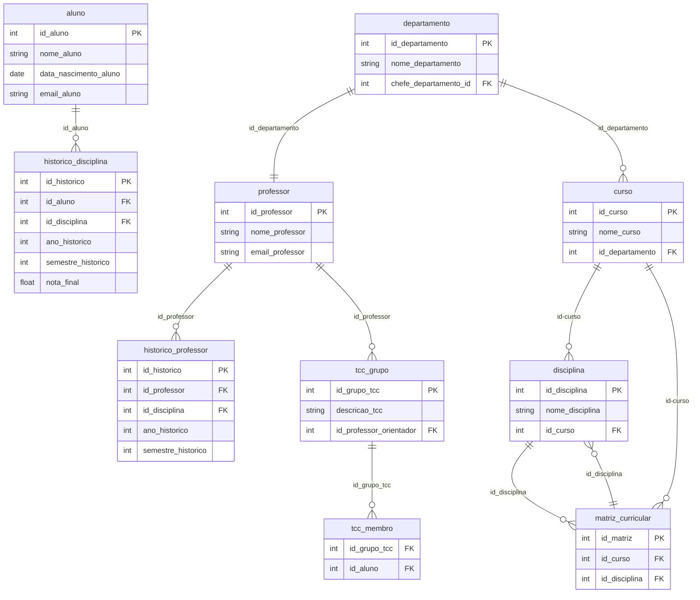

```mermaid
erDiagram
    aluno ||--o{ historico_disciplina : id_aluno
    professor ||--o{ historico_professor : id_professor
    professor ||--o{ tcc_grupo : id_professor
    departamento ||--|| professor : id_departamento
    departamento ||--o{ curso : id_departamento
    curso ||--o{ disciplina : id-curso
    disciplina ||--o{ matriz_curricular : id_disciplina
    curso ||--o{ matriz_curricular : id-curso
    matriz_curricular ||--o{ disciplina : id_disciplina
    tcc_grupo ||--o{ tcc_membro : id_grupo_tcc

    aluno {
        int id_aluno PK
        string nome_aluno
        date data_nascimento_aluno
        string email_aluno
    }

    professor {
        int id_professor PK
        string nome_professor
        string email_professor
    }

    departamento {
        int id_departamento PK
        string nome_departamento
        int chefe_departamento_id FK
    }

    curso {
        int id_curso PK
        string nome_curso
        int id_departamento FK
    }

    disciplina {
        int id_disciplina PK
        string nome_disciplina
        int id_curso FK
    }

    matriz_curricular {
        int id_matriz PK
        int id_curso FK
        int id_disciplina FK
    }

    historico_disciplina {
        int id_historico PK
        int id_aluno FK
        int id_disciplina FK
        int ano_historico
        int semestre_historico
        float nota_final
    }

    historico_professor {
        int id_historico PK
        int id_professor FK
        int id_disciplina FK
        int ano_historico
        int semestre_historico
    }
    
    tcc_grupo {
        int id_grupo_tcc PK
        string descricao_tcc
        int id_professor_orientador FK
    }

    tcc_membro {
        int id_grupo_tcc FK
        int id_aluno FK
    }
```
