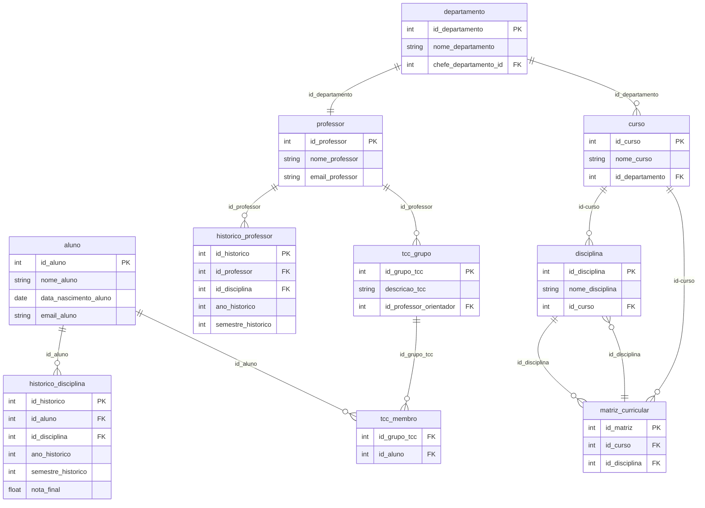

# Banco de Dados - SQL (PostgreSQL)

---
- Caio de Souza Conceição
- Pedro Henrique Algodoal
- Samir Oliveira da Costa
  
---

## Descrição do Projeto

Este projeto envolve a criação de um banco de dados para simular um modelo de uma instituição de ensino.

## Instruções de Uso

### 1. Criação do Banco de Dados
Primeiramente, crie um banco de dados no PostgreSQL com o nome "BANCO6".

### 2. Execução do Script SQL
Execute o script `create_tables.sql` no banco de dados criado. Este script irá criar todas as tabelas necessárias para o funcionamento do banco de dados.

```sql
-- Script: create_tables.sql
```

### 3. População das Tabelas
Execute o arquivo `populate_tables.py` para popular as tabelas com dados fictícios. Certifique-se de ter a biblioteca **Faker** instalada. Além disso, altere as configurações do banco de dados no script Python para refletir a autenticação e o banco de dados que você criou.

```bash
pip install faker psycopg2
```

No arquivo `populate_tables.py`, altere as informações de conexão com o banco, como:

```python
conn = psycopg2.connect(
    host="localhost",
    user="postgres",
    password="123123",  # Substitua pela senha do seu banco de dados
    dbname="BANCO6"     # Substitua pelo nome do banco de dados
)
```

Após a alteração, execute o script:

```bash
python populate_tables.py
```

Este script irá preencher as tabelas com dados gerados aleatoriamente.

### 4. Consultas SQL
As consultas SQL fornecidas são exemplos para recuperar informações de diferentes áreas do sistema (ARQUIVO QUERIES.SQL):

1. **Histórico de Disciplinas de um Aluno**
2. **Histórico de Disciplinas Ministradas por um Professor**
3. **Alunos que se Formaram em um Ano e Semestre Específicos**
4. **Professores Chefes de Departamentos**
5. **Grupos de TCC com Orientadores e Membros**

---


